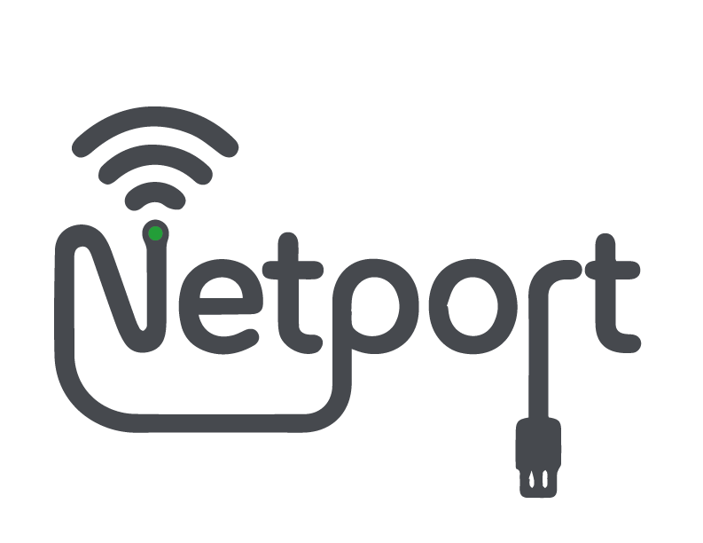

<!-- Logo del proyecto -->

  

---

<h1 align="center">NetPort Configurator</h1>

  Aplicación de escritorio para <b>Windows</b> desarrollada con <b>Tauri</b> y <b>HTML/CSS/JavaScript</b> para visualizar y modificar configuraciones de puertos de red.

<!-- Badges -->

  
  

  
  

---

## Enlace a la documentación

Para obtener información completa sobre el uso, instalación y características de la aplicación, visita nuestra página de documentación: [NetPort Configurator Documentation](https://masu-113.github.io/).

---

## Estado del proyecto

- **Licencia**: [MIT](https://github.com/Masu-113/NetPort-Configurator#)
- **Estado**: En desarrollo

---

## Características

- Visualización de puertos de red disponibles.
- Configuración rápida de VLAN ID, IP, máscara y gateway.
- Integración con scripts de PowerShell para aplicar cambios.

---

## Contribuciones

Las contribuciones son bienvenidas. Si deseas colaborar, por favor abre un issue o un pull request en este repositorio.

---

## Créditos

- **Marlon José Suárez Baltodano**: Desarrollador principal.
- **Yelizabeth Danyali Ninoska Diaz Montano**: Responsable del diseño del logo e ícono del proyecto. [Instagram](https://www.instagram.com/yelyaly14?igsh=YWlrMHVncjZ5MGVh)

---

## Contacto

Si tienes preguntas o sugerencias, no dudes en contactarnos a través de los issues en este repositorio.
